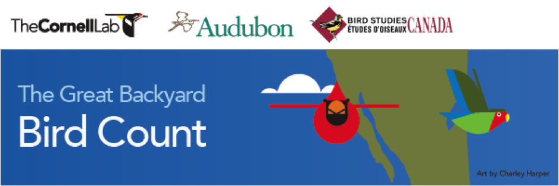

# Proposing Interventions and Theories of Change
As a practitioner, you might want to inform your interventions with science, choosing the most likely path to impact. As a scientist, you want to explore the unknown, even if it doesn't always create impact. How do you decide which to do? You are facing question of exploration vs exploitation. This assignment invites you and your partner to think about both.

Background: [The Great Backyard Bird Count](https://www.birdcount.org/) is often a first step for people who continue on to contribute to citizen science through the Lab of Ornithology. Imagine you are asked to develop a new experiment involving an email headline and call to action—and given the task of advancing knowledge *and* benefiting the lab. As an alumnus of COMM 4242, you have read an article on recruiting and retaining participants in citizen science [1] and know the state of knowledge. So you're well equipped for this task. In pairs:

* Look at the example of [the 2019 follow-up email](GBBC-example-email-2019.png)
* Read this article on the reasons people participate in citizen science:
  * West, S. E., & Pateman, R. M. (2016). [Recruiting and retaining participants in citizen science: What can be learned from the volunteering literature?](https://theoryandpractice.citizenscienceassociation.org/articles/10.5334/cstp.8/) Citizen Science: Theory and Practice. (pay particular attention to the section on sustained participation)
  * To brainstorm, create a list of no more than 10 possible ⬆️ promoting pressures and ⬇️ inhibiting pressures for someone to open the email, click a link, and sign up for a further project. 
    * Changing the headline / email subject
    * Changing the text and layout of the Call to Action
    * To help your own thinking, on a scale of 1 to 10, identify how confident you are, based on the state of scientific knowledge, that this pressure will be influential
* Create two pairs of headlines/subjects based on those pressures:
  *  One that you think is highly likely to be influential, based on the state of science
  *  One that you think could help advance the state of science

Submit an essay in a Word Doc or PDF to Canvas. The essay should include:

* One paragraph summarizing the goal of influencing people to volunteer to citizen science
* One paragraph summarizing no more than three promoting or inhibiting pressures that matter for the interventions you designed
* One paragraph each that explains each of your two interventions
  * Name the pressures involved
  * Summarize the intervention (headline, call to action) and how it relates to the pressures
  * Explain your confidence in the outcome in terms of how likely it is to succeed or how likely it is to advance science
* An appendix that includes:
  * Your two interventions:
    * Headline
    * Call to action, with photo
  * Your list of possible promoting and inhibiting pressures

